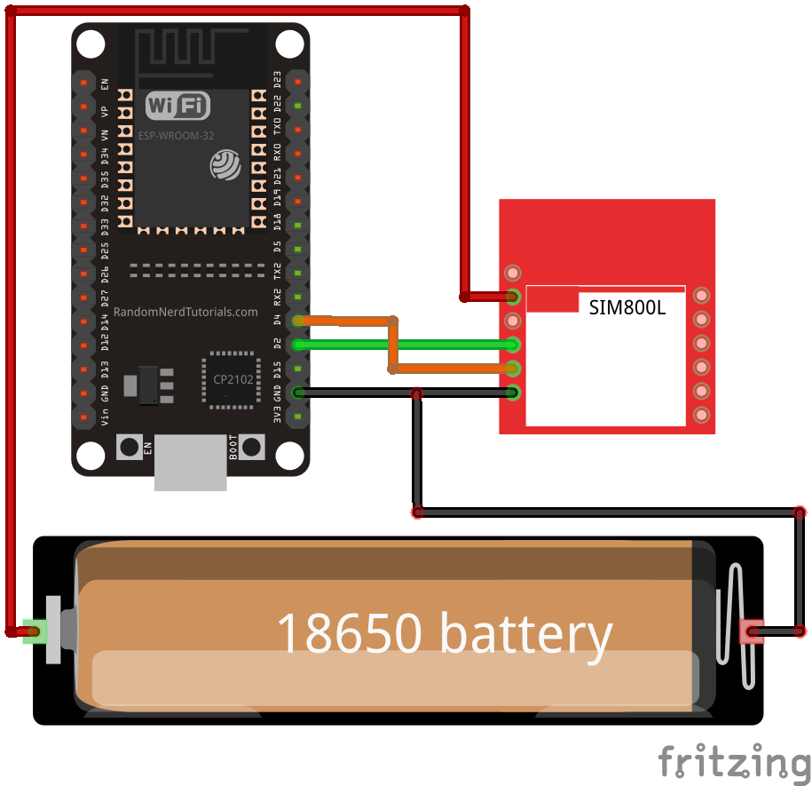
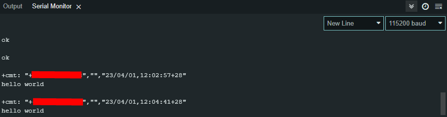

# Read_SMS_SIM800L_ESP32
Getting started with SIM800L and ESP32 by reading message has been received.

## Wiring Diagram
### SIM800L
* VCC : Direct to + of 18650 Battery  
* RX  : D2 Pin of ESP32  
* TX  : D4 Pin of ESP32  
* GND : GND Pin of ESP32 AND Direct to "-" of 18650 battery.  

### 18650 Battery
This battery output voltage range is 3.7 to 4.2. (Commonly stable at 4.0V)
* "+" : Direct to SIM800L VCC  
* "-" : GND Pin of ESP32 AND Direct to GND Pin of SIM800L.  

## Notes
* Make sure you are using a registered sim card.  
* Make sure you have already insert the sim card properly.  
* The SIM800L voltage range based on the datasheet is 3.7 to 4.2 Volt. It only work if you have a stable voltage from the power supply (In this case is the 18650 battery).  
* You shouldnt connect the sim800l VCC directly to ESP32 VIN or 3v3 pin. It could damage your sim modul.

## Output Example
An output example of receiving a messange `hello world`

